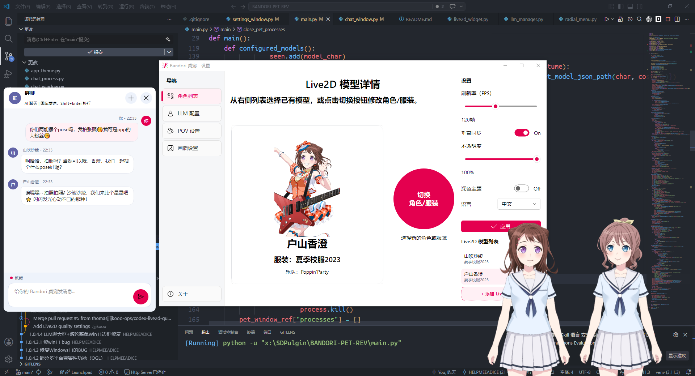

# 🎸 BandoriPet — 把バンドリ角色养在桌面上！

<p align="center">
  <a href="https://github.com/HELPMEEADICE/BANDORI-PET-REV"></a>
  <a href="https://github.com/HELPMEEADICE/BANDORI-PET-REV/blob/main/LICENSE"></a>
  <a href="https://github.com/HELPMEEADICE/BANDORI-PET-REV/stargazers"></a>
  <a href="https://github.com/HELPMEEADICE/BANDORI-PET-REV/network/members"></a>
  <a href="https://www.python.org/"></a>
  <a href="https://luajit.org/"></a>
  <a href="https://www.live2d.com/"></a>
  <a href="https://github.com/HELPMEEADICE/BANDORI-PET-REV"></a>
</p>

> **⚠️ 免责声明：本项目仅供学习交流使用。角色模型版权归原作者及版权方所有，请勿用于商业用途。详情见 [DISCLAIMER.md](DISCLAIMER.md)。**

你是否曾幻想过香澄每天早上对你喊「キラキラドキドキ！」？你是否想在工作摸鱼的时候让友希那在一旁冷冷地盯着你（然后偷偷露出猫耳）？你是否想让爱音在你桌面上炫耀她刚学会的吉他 riff？你是否想把祥子和灯放在同一张桌面上上演属于你的 MyGO×AveMujica 小剧场……

**现在，你的梦想实现了！！！**

BandoriPet 是一个基于 Live2D Cubism SDK 和 PySide6 的开源桌面宠物项目，支持 **51+ 位** BanG Dream! 角色、**305+ 套**服装，让你的桌面一秒变成 CiRCLE 排练室！

QQ群：1046229865



---

## ✨ 特性

- ⚡ **自研 LuaJIT 渲染核心** — 基于 [Live2D-v2-Lua](https://github.com/EasyLive2D/Live2D-v2-Lua)（作者 [@HELPMEEADICE](https://github.com/HELPMEEADICE)），纯 LuaJIT 实现，性能相较原 live2d-py 提升 **6 倍+**（30fps → 180fps+），支持头部追踪、拖拽移动、点击互动，老婆会跟着你的鼠标转头！
- 💬 **LLM 角色扮演 + 好感度记忆系统** — 接入大语言模型，每个角色都有专属 System Prompt，支持中日英多语言 + 动作标签。交互越多角色越了解你，好感度影响情绪和回复风格，支持人设方案保存/切换。
- 🎨 **像素风桌面宠物** — 也可以切成像素小人的形态，CPU 友好，可爱不减！
- 🌓 **Fluent Design 设置面板** — 暗色/亮色主题切换，图形化选角选装界面。完全支持 i18n 中英文国际化。
- 📌 **始终置顶 + 无边框** — 趴在你的窗口上方，赶都赶不走（误）。
- 🔔 **系统托盘** — 右键一键切角色 / 开设置 / 优雅退场。
- 🔊 **TTS 语音合成** — 接入 Qwen3TTS 后端，角色说话时自动语音播放 + Live2D 口型同步，支持中日英多语言。
- 🔗 **聊天软件接入** — 本地 Webhook 端口可接收 QQ/微信/Telegram/Discord 等机器人转发消息，设置页支持复制地址、生成 Token 和一键测试。
- 👥 **多角色同时显示** — 不止一个！你想放几个就放几个（只要你 GPU 撑得住）。
- 🤖 **MCP + Computer Use 支持** — 通过 MCP 协议集成文件系统操作、浏览器控制等 AI Agent 扩展能力，让角色拥有"手"和"眼睛"。
- 🌐 **多 LLM 后端 & 搜索增强** — 支持多组 API 配置切换，多后端同时在线，内置 Bing/Google 等多搜索引擎增强检索。

---

## 📦 快速开始

### 1. 环境要求

- **Python 3.10+** & **LuaJIT 2.1+**
- Windows, macOS, Linux(部分兼容)
- 支持 OpenGL 3.3+ 的显卡（核显也能跑）

### 2. 克隆仓库

```bash
git clone https://github.com/HELPMEEADICE/BANDORI-PET-REV.git
cd BANDORI-PET-REV
```

### 3. 下载模型文件（必需！）

> 💡 **推荐：zstd 压缩流格式模型包**（~900MB，流式加载无需解压到磁盘，性能损失极低）
>
> | 下载渠道 | 链接 |
> |----------|------|
> | 🚀 **ModelScope** | [models.zip](https://modelscope.cn/datasets/HELPMEEADICE/BanG-Dream-Live2D/resolve/master/models.zip) |
> | ☁️ **Google Drive** | [下载](https://drive.google.com/file/d/1rSwE6oHIyESYmbF7B_GtogAVbjASyBb9) |
> | 🐌 **百度网盘** | [下载](https://pan.baidu.com/s/1oapb5rxt1Qz5nRkyb3XZtw?pwd=3724) 提取码：`3724` |

> 🚨 **传统 7z 模型包**（~4GB，需解压到磁盘）
>
> | 下载渠道 | 链接 |
> |----------|------|
> | 🚀 **ModelScope** | [models.7z](https://modelscope.cn/datasets/HELPMEEADICE/BanG-Dream-Live2D/resolve/master/models.7z) |
> | ☁️ **Google Drive** | [下载](https://drive.google.com/file/d/1qX9rEhBviT5auwCLg7g3klBbT5wAbjnL) |
> | 🐌 **百度网盘** | [下载](https://pan.baidu.com/s/17GAJy2_WEZZbdVdZAMfXHQ?pwd=3724) 提取码：`3724` |

下载后将 `models/` 放入项目根目录。若使用 7z 包，解压后的目录结构应为：

```
BandoriPet/
├── models/
│   ├── kasumi/
│   ├── yukina/
│   ├── anon/
│   ├── tomorin/
│   └── ...
```

### 4. 安装依赖

**Python 包：**

```bash
pip install -r requirements.txt
```

**第三方依赖（从源码编译时需要）：**

```bash
mkdir third_party

# PyQt-Fluent-Widgets（必须用 PySide6 分支！）
git clone -b PySide6 --single-branch https://github.com/zhiyiYo/PyQt-Fluent-Widgets.git third_party/PyQt-Fluent-Widgets
pip install -e third_party/PyQt-Fluent-Widgets

# Live2D-v2-Lua（自研 LuaJIT Live2D 渲染核心，无需 pip install）
git clone https://github.com/EasyLive2D/Live2D-v2-Lua.git third_party/Live2D-v2-Lua
```

### 5. 启动！

```bash
python main.py
```

---

## 🔊 TTS 语音合成（可选）

BandoriPet 支持接入本地 Qwen3TTS 推理后端，让角色用声音回应你，配合 Live2D 实时口型同步。

### 下载 TTS 后端

| 版本 | 适用场景 | 下载链接 |
|------|----------|----------|
| 🌟 **LoRA 多角色版**（推荐） | 基于 1.7b，按角色所属乐队加载对应 LoRA，声线更贴合角色 | [ModelScope](https://modelscope.cn/models/HELPMEEADICE/Qwen3TTS-Faster/resolve/master/Qwen3TTS-1.7b-API-LoRA.7z) |
| 🐓 **1.7b 标准版** | 显卡较好，追求音质 | [ModelScope](https://modelscope.cn/models/HELPMEEADICE/Qwen3TTS-Faster/resolve/master/Qwen3TTS-1.7b-API.7z) |
| 🐣 **0.6b 低参数版** | 显卡配置较低，追求速度 | [ModelScope](https://modelscope.cn/models/HELPMEEADICE/Qwen3TTS-Faster/resolve/master/Qwen3TTS-0.6b-API.7z) |

| 备用渠道 | 链接 |
|----------|------|
| ☁️ **Google Drive**（三个版本都有） | [下载](https://drive.google.com/drive/folders/17-FPovU0bVjZu-wuCmKUoXPujI2xUhB3) |
| 🐌 **百度网盘**（三个版本都有） | [下载](https://pan.baidu.com/s/1NGNECjBX0S-MEVLTLpfzjQ?pwd=3724) 提取码：`3724` |

下载后解压，运行后端 API 服务（默认监听 `http://127.0.0.1:9880/`），然后在设置面板 → **TTS 配置** 中开启并调整参数即可。

> 💡 **语音克隆**：`audio_reference/` 目录下已内置 47 位角色的日文参考音频，TTS 会自动根据当前聊天角色选择对应的声线。

---

## 🤖 MCP + Computer Use（可选）

BandoriPet 集成了 **MCP（Model Context Protocol）** 和 **Computer Use** 能力，让 LLM 角色可以调用本地工具与你互动。

### MCP 服务器
- **文件系统操作** — 角色可以读取/创建项目文件、管理目录
- **计算机操控** — 角色可以操控鼠标键盘、截屏（需要手动授权）
- **可扩展** — 支持加载任意 MCP 服务器

### 使用方式

在设置面板 → **MCP 配置** 中启用需要的工具。详细说明见 [MCP_COMPUTER_USE_GUIDE.md](MCP_COMPUTER_USE_GUIDE.md)。

---

## 💖 好感度 / 记忆系统

每和一个角色聊天，系统会自动记录好感度、信任、熟悉度和当前心情，让角色的回复风格随关系变化。

### 聊天命令

| 命令 | 效果 |
|------|------|
| `@状态` | 查看当前角色的好感度、信任、熟悉度和当前心情数值 |
| `@记忆` | 查看全局用户偏好和当前角色的专属记忆 |
| `@记住 xxx` | 手动让角色记住某件事 |
| `@忘记 xxx` | 删除指定记忆 |
| `@好感度 80` | 直接设置好感度数值（0-100） |
| `@信任 70` | 直接设置信任数值（0-100） |
| `@熟悉度 60` | 直接设置熟悉度数值（0-100） |
| `@当前心情 75` | 直接设置当前心情数值（0-100） |

以上命令也支持英文别名（`@status`, `@memory`, `@remember`, `@forget`, `@affection`, `@trust`, `@familiarity`, `@setmood`）和前导 `/`（如 `/状态`）。

### 自动记忆

角色会自动从聊天中提取你的个人信息（名字、生日、喜好等）并保存。你可以在设置面板 → **好感度/记忆** 页面查看和整理所有记录。

---

## 🧸 支持的乐队 & 角色

全部 **51 位**角色均支持 Live2D 模型显示与 **300+ 套**服装。已配置 LLM 角色扮演 Prompt 的角色可开启 AI 对话。

| 乐队 | 角色 | 服装 | LLM |
|------|------|:---:|:---:|
| **Poppin'Party** | 户山香澄 · 花园多惠 · 牛込里美 · 山吹沙绫 · 市谷有咲 | ✅ | ✅ |
| **Afterglow** | 美竹兰 · 青叶摩卡 · 上原绯玛丽 · 宇田川巴 · 羽泽鸫 | ✅ | ✅ |
| **Pastel\*Palettes** | 丸山彩 · 冰川日菜 · 白鹭千圣 · 大和麻弥 · 若宫伊芙 | ✅ | ✅ |
| **Hello, Happy World!** | 弦卷心 · 濑田薰 · 北泽育美 · 松原花音 · 奥泽美咲 | ✅ | ✅ |
| **Roselia** | 凑友希那 · 冰川纱夜 · 今井莉莎 · 宇田川亚子 · 白金燐子 | ✅ | ✅ |
| **RAISE A SUILEN** | LAYER · MASKING · LOCK · PAREO · CHU² | ✅ | ✅ |
| **Morfonica** | 仓田真白 · 桐谷透子 · 广町七深 · 二叶筑紫 · 八潮瑠唯 | ✅ | ✅ |
| **MyGO!!!!!** | 千早爱音 · 高松灯 · 要乐奈 · 椎名立希 · 长崎素世 | ✅ | ✅ |
| **Ave Mujica** | 丰川祥子 · 若叶睦 · 三角初华 · 八幡海玲 · 祐天寺若麦 | ✅ | 🚧 |
| **其他角色** | 纯田真奈 · 户山明日香 等 | ✅ | 🚧 |

> 40+ 角色已配置本地角色扮演 Prompt（`characters/` 目录）。更多角色的 Prompt 模板见 `PROMPT.md`，欢迎提交 PR 补全！

---

## 🎨 像素宠物 & 角色扮演扩展

`pixels/` 目录下目前有有咲和乐奈的像素小人（`.webp` + 动作帧配置）。

`characters/` 目录下有 40+ 位角色的高级 LLM 角色扮演 Prompt（含动作标签和表情系统）。

**想要更多像素角色？想要给未配置的角色注入灵魂？**

👉 **热烈欢迎 PR！** 只要你推的角色还没上，这就是你的回合！🎉

- 像素风格宠物：参考 `pixels/` 下的格式添加新角色动作帧即可。
- 高级角色扮演 Prompt：参考 `PROMPT.md` 和 `characters/` 下的现有 Prompt 格式。

只要你也推 XX，我们就是异父异母的亲兄弟姐妹！🥹

---

## 🏗️ 从源码打包

本项目使用 `cx_Freeze` 打包为独立可执行文件：

```bash
python setup.py build
```

构建产物在 `BUILD/` 下。注意打包时模型文件不会被打包进去，用户需自行下载放入 `models/`。

如需生成 Windows 安装包：

```bash
python setup.py build_msi
```

### 自动更新发布约定

设置页的「关于」中带有检查更新入口。三种运行方式会自动走不同更新路径：

| 运行方式 | 更新方式 |
|----------|----------|
| `git clone` 后运行源码 | `git fetch` 检查上游，点击更新后执行 `git pull --ff-only`，并用当前 Python 安装 `requirements.txt` |
| 便携版 exe | 从 GitHub Release 下载最新 `.zip`，关闭程序后覆盖当前目录并重启 |
| MSI 安装包 | 从 GitHub Release 下载最新 `.msi`，启动安装器完成升级 |

发布新版本时请同步修改 `app_info.py` 中的 `APP_VERSION`，并在 GitHub Release 上传匹配当前平台的资产，例如：

```text
BandoriPet-3.0.1-WIN-AMD64.zip
BandoriPet-3.0.1-WIN-AMD64.msi
```

如果你要从自己的仓库发布更新，请把 `app_info.py` 里的 `APP_REPOSITORY` 改成发布 Release 的仓库名。

---

## 🛠️ 技术栈

| 技术 | 用途 |
|------|------|
| **PySide6** | Qt for Python 主框架 |
| **Live2D-v2-Lua** | 自研 LuaJIT Live2D v2 渲染核心（替代 live2d-py，性能提升 6x+） |
| **lupa** | Python ↔ LuaJIT FFI 桥接 |
| **PyQt-Fluent-Widgets** | Win11 风格 Fluent Design 组件库 |
| **PyOpenGL** | OpenGL 渲染后端 |
| **cx_Freeze** | 打包为独立 exe |
| **OpenAI / MCP SDK** | LLM API 接入 & MCP 协议扩展 |
| **sounddevice / soundfile** | TTS 语音合成播放 |

---

## 📄 许可

本项目代码基于 [GPLv3](LICENSE) 开源。

角色模型、贴图、动作等资源文件版权归原版权方所有，请勿用于商业用途。

---

## 🙏 致谢

- [Live2D Cubism SDK](https://www.live2d.com/)
- [PyQt-Fluent-Widgets](https://github.com/zhiyiYo/PyQt-Fluent-Widgets)
- [Live2D-v2-Lua](https://github.com/EasyLive2D/Live2D-v2-Lua) — 自研 LuaJIT 渲染核心
- 所有为 BanG Dream! 角色模型做出贡献的同人作者们 💙

## ⭐ Star History

[](https://star-history.com/#HELPMEEADICE/BANDORI-PET-REV&Date)

---

<p align="center"><strong>キラキラドキドキ！～ ✨</strong></p>
